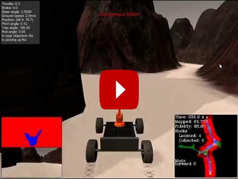

[//]: # (Image References)
[image_0]: ./misc/header.PNG
[image_1]: ./misc/writeup_1.png
[image_2]: ./misc/writeup_2.png
[image_3]: ./misc/writeup_3.png
[image_4]: ./misc/writeup_4.png
[image_5]: ./misc/writeup_5.png
[image_6]: ./misc/writeup_6.png

# Search and Sample Return Project

![alt text][image_0] 

The main objective of this project is to program a rover to autonomously navigate and perform various tasks in a simulated environment built with the Unity game engine. This project is modeled after the [NASA sample return challenge](https://www.nasa.gov/directorates/spacetech/centennial_challenges/sample_return_robot/index.html) with the goal to provide firsthand experience with the three essential elements of robotics, which are perception, decision making and actuation. 

Autonomous navigation and object detection is achieved by using thresholding techniques which allow us to identify the navigable regions and obstacles in each image. Thresholding is a technique that replaces each pixel in an image with its binary representation if its intensity is within a given threshold. 

## The Simulator
- [Linux](https://s3-us-west-1.amazonaws.com/udacity-robotics/Rover+Unity+Sims/Linux_Roversim.zip)
- [Mac](	https://s3-us-west-1.amazonaws.com/udacity-robotics/Rover+Unity+Sims/Mac_Roversim.zip)
- [Windows](https://s3-us-west-1.amazonaws.com/udacity-robotics/Rover+Unity+Sims/Windows_Roversim.zip) 

## Dependencies
- Python 3 
- Jupyter Notebooks 

# Rubric Points

## Notebook Analysis
**1. Run the functions provided in the notebook on test images (first with the test data provided, next on data you have recorded). Add/modify functions to allow for color selection of obstacles and rock samples.**

The simulated robot has a camera feed. All our navigation and detection is based on the feed from this camera. We first must establish an understanding of what is the robot’s perspective from that camera’s point of view. On the below images we can first see a 1m x 1m temporary grid.

![alt text][image_1] 

Using the OpenCV library we can then perform a perspective transform by taking advantage of the grid and using locations as reference points. The image below shows the result of the transform. We now have a top down view of the world based on the input from the camera.

![alt text][image_2] 

From the virtual environment we can easily distinguish between navigable terrain and obstacles due to the color of each. Navigable terrain is much lighter than obstacles such was rocks and mountains. We can use color threshold techniques to extract the navigable regions. `color_threshold` is used to set threshold intensity limit on a Red, Green and Blue. This then outputs the result of the threshing which looks like the image below:

![alt text][image_3]

The same technique is used to thresh for rocks. The main difference is the threshold level for Red, Green and Blue.

![alt text][image_5]

To determine the best navigable path, we take advantage of the previously threshed image. The optimal path for the robot is going to be represented by an availability of white pixels on the image. By the same token we can computer the direction the robot should taking by taking the average angle of all navigable terrain pixels (white pixels) in the rover’s field of view.  

![alt text][image_4]

**1. Populate the process_image() function with the appropriate analysis steps to map pixels identifying navigable terrain, obstacles and rock samples into a worldmap. Run `process_image()` on your test data using the moviepyfunctions provided to create video output of your result.**

`process_image()` This is the place where all of the previously discussed steps happen in sequential order of operation. 
- Perspective Transform
- Color Thresholding
- Robot Coordinates
- Navigation angle
*OUTPUT VIDEO USING MOVIEPI*

## Autonomous Navigation and Mapping

**1. Fill in the `perception_step()` (at the bottom of the `perception.py` script) and `decision_step()` (in `decision.py`) functions in the autonomous mapping scripts and an explanation is provided in the writeup of how and why these functions were modified as they were.**

perception.py is a used in the actual virtual environment not jupyter notebooks. The same concept that was implement in `process_image()` is used in perception.py 
We perform a few steps in order to make sense of the environment.
- Perspective transform
- Color Thresholding
- Robot coordinates
- Navigation angle

decision.py is used as the guiding principle for the robot’s decision matrix.  This is a tree based approach that uses information previously obtain from the perception step. An example decision tree is below:

![alt text][image_6]

**2. Launching in autonomous mode your rover can navigate and map autonomously. Explain your results and how you might improve them in your writeup.**

*The simulator was configured in the following fashion:*
-	Screen Resolution: 1024x768
-	Windowed: True
-	Graphics quality: Fantastic
-	FPS:  24
-	OS: Windows 10

*The results were as follow:*
-	Time: 359s
-	Mapped: 73%
- 	Fidelity: 80.9%
-	Rocks Located: 4

*Some of the problems that were encountered, and the approach taken are below:*
1) Robot getting stuck: This was by far the biggest problem, many of the rocks were not detected by the single camera alone. The solution to this issue was to write a ImStuck() routine where it tries various maneuvers in order to get unstuck.
2) Robot not exploring sufficient part of the map: This issue was a little bit harder, the robot would randomly stick around the same area. The approach taken was to follow one wall closer to the other vs just driving in the center. By following closer towards one side (Left) the rover has a higher chance to navigate the map to a bigger extent. 
3) Fidelity: Initially the fidelity of the pixels being mapped in comparison to the truth map was much lower (<60%). The approach taken was to skip map data when the rovers pitch and roll angle exceeded specific thresholds. 

A video of one of the attemps can found below:

